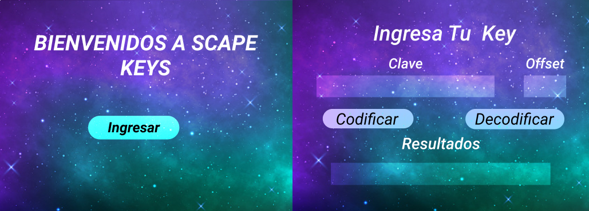
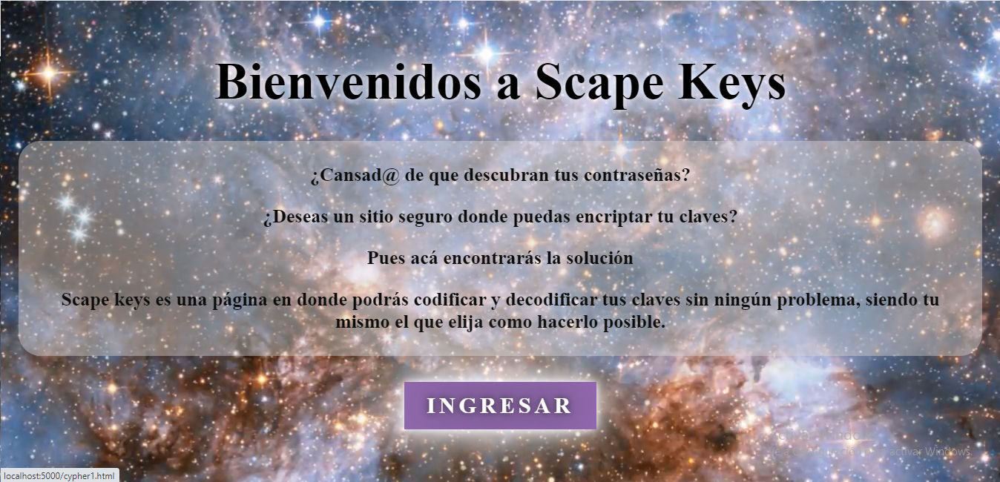
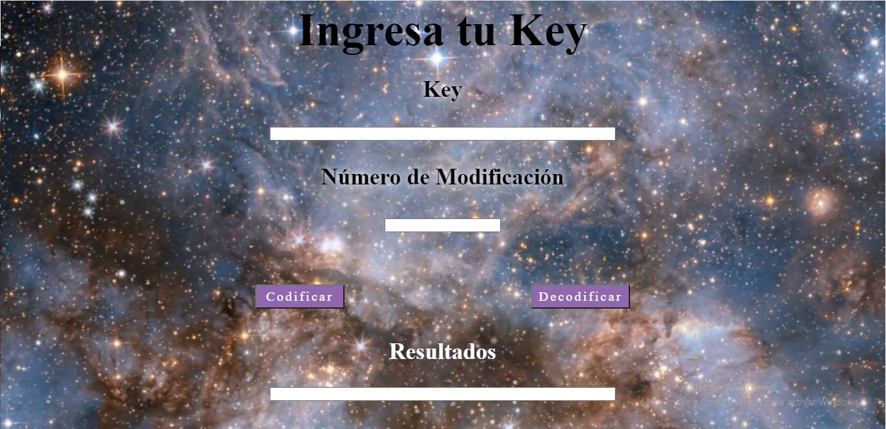

# PROYECTO SCAPE KEYS (CIPHER)

Este proyecto consiste en el cifrado Cesar, el cual tenia como finalidad enviar un mensaje cifrado. El emperador romano Julio César lo usaba para enviar órdenes secretas a sus generales en los campos de batalla.
Es un tipo de cifrado por sustitución, es decir que cada letra del texto original es reemplazada por otra que se encuentra un número fijo de posiciones (desplazamiento) más adelante en el mismo alfabeto.

 
 ## Índice
 
* [1. Objetivo](#1-Objetivo)
* [2. Usuario Objetivo](#2-Usuario-Objetivo)
* [3. Planificación del Proyecto](#3-Planificación-del-Proyecto)
* [4. Prototipo](#4-Prototipo)
* [5. Diseño Definitivo](#5-Diseño-Definitivo)
* [6. Herramientas Utilizadas](#6-Herramientas-Utilizadas)
* [7. Link Del Proyecto](#7-Link-Del-Proyecto)
  
  ***

 ## 1. Objetivo

 El objetivo de este proyecto es proporcionarle al usuario la facilidad de cifrar sus claves, siendo el mismo usuario quien escoja cuanto es la cantida de desplazamiento, que desea en su contraseña, ademas de esto, la pagina también otorga la posibilidad de decifrar la clave que ya ha sido cifrada, permitiendo al usuario tener completo manejo de la modificiación que desee realizar. El objetivo printicpal de este proyecto es hacer mas segura las claves de acceso para quienes lo desean.

 ## 2. Usuario Objetivo

 En este caso el usuario destinado, es cualquiera que posea contraseñas o claves que desee encriptar, no hay un limite en la edad, ya que como consumidores de paginas, plataformas y sitios web, resulta bastante beneficioso, poder optar a este tipo de facilidades con respecto a seguridad y privacidad se trate.

 ## 3. Planificación del Proyecto

 La Planificación que realicé, fue escoger de que se trataria mi proyecto en este caso, decidí hacerlo de cifrado de contraseñas, ya que bajo mi experiencia y la de otro sujetos a los cuales consulte, llegué a la conclusíon que otorgale al usuario un lugar donde poder modificar sus claves, era bastante útil, ya que hoy en dia, la vulnerabilidad de claves se ha visto bastante afectada, ademas que cada dia se utilizan mas y mas plataformas con dicha información de acceso.
 Ya teniendo la elección hecha de lo que trataria mi proyecto, realicé una pauta, con los pasos a seguir, para desarrollar todo, la herramienta que escogí para esto fue Trello. (más abajo adjunto la planificacíon realizada ahí).

 [Pincha Aqui! si deseas ver La planificación de este Proyecto](https://trello.com/b/w2WRhRmN/planificaci%C3%B3n-cypher)

 ## 4. Prototipo

 El prototipo del proyecto lo realicé en Figma, la idea con respecto a la visual y el sentido que queria propocionarle  a la pagina era mas bien espacial, como veremos a continuación en la siguiente imagén, además cabe mencionar que el proyecto se desarrolaria en 2 html, en otras palabras, en 2 pantallas o páginas en este caso.

***
 ## 5. Diseño Definitivo

En el transcurso de lo proyecto, se decidio cambiar el diseño la página, por lo que el background que se utilizó en primera instancia fue reemplazado por un archivo de tipo video, mantiendo la temitica de que sea espacial. Esto se decidió ya que hace mas atractivo y se acerca mas a lo que los usuarios desearian ver con respecto al atractivo del proyecto.

***
## 6. Herramientas Utilizadas
Las herramientas utilizadas para la confeccion y dessarrollo de este proyecto fueron
* **Figma**
* **HTML**
* **JavaScript**
* **CSS** 

Te invito a vivir la experiencia tu mismo de éste, mi primer proyecto del mundo de la programación 

